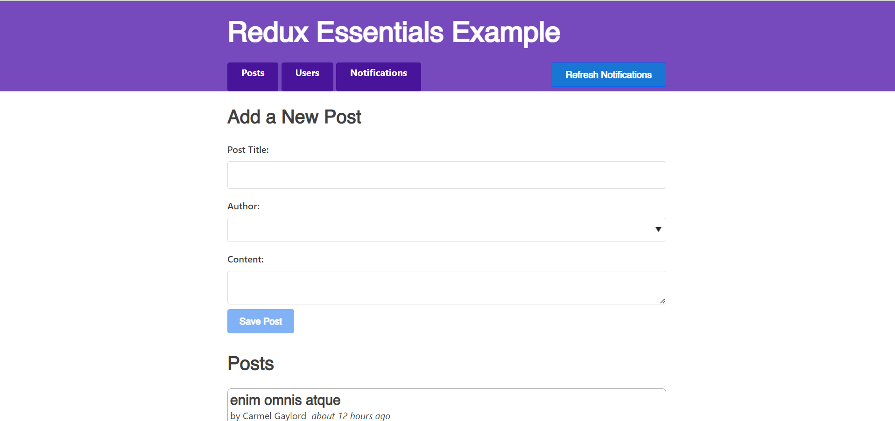
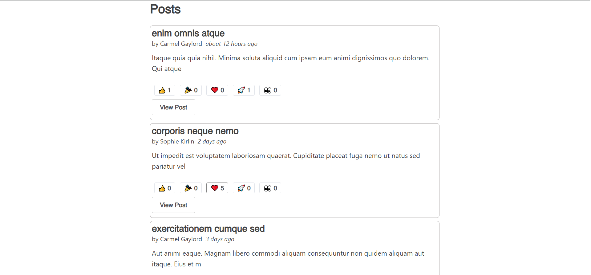
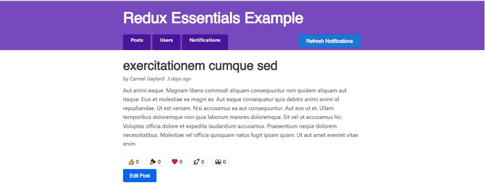

# Redux Doc Social Media

A sample social media implemented with Redux Toolkit.

>Redux Toolkit is a set of tools that helps simplify Redux development. It includes utilities for creating and managing Redux stores, as well as for writing Redux actions and reducers. The Redux team recommends using Redux Toolkit anytime you need to use Redux.

This app is created while studying [Redux Toolkit Essentials](https://redux.js.org/tutorials/essentials/part-1-overview-concepts).
The purpose of developing this app was to learning Redux concepts such as:
- Redusers
- Actions
- Slices
- Async Thunk
- Entity Adapter
- Selectors
- React Redux Hooks (useSelector, useDispatch)

## What application does
- Fetch fake data of posts from an api
- Add new post to slice from user input
- Fetch users and it's relationship with posts
- Add reaction to each post
- Get list of posts by a specific user
- Routing and navigation between posts, users, post detail and notifications

## Overview


<p align="center" style="margin-bottom: 2rem;">Topbar and add post form</p>



<p align="center" style="margin-bottom: 2rem;">Lists of posts and reactions assigned to them</p>


<p align="center" style="margin-bottom: 2rem;">Lists of users</p>


<p align="center" style="margin-bottom: 2rem;">Lists of posts by a single user</p>


<p align="center" style="margin-bottom: 2rem;">Post Details Page</p>


## Installation
```
# copy the project to your local machine
git clone https://github.com/alborzasd

# change directory of terminal to the project
cd redux-doc-social-media

# install dependencies
npm install

# start development server
npm start
```
